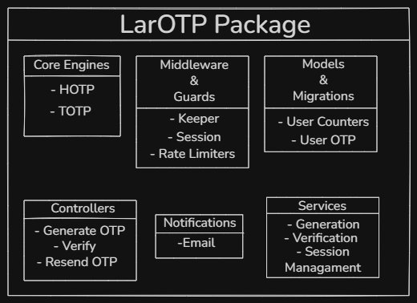

# LarOTP - Concept Document

**Version:** 0.5.0\
**Date:** May 2026\
**Author:** Kevin Andeka\
**Status:** In Development

## **Executive Summary**

LarOTP is an open-source Laravel package that provides robust One-Time passwords (OTP) authentication, supporting both HOTP (counter-based) and TOTP (time-based) protocols. It addresses the fundamental UX problem of password fatigue while maintaining enterprise-grade security standards.

**Problem:** Users create duplicate accounts and forget passwords, leading to high and frequent support costs and poor user experience\
**Solution:** Passwordless authentication using temporary codes sent via secure channels(SMS/Emails), reducing user friction while not compromising on security.

**Target Users:** Laravel Developers building public facing applications requiring secure, user-friendly authentication.

## **Problem Statement**

### **Current Pain Points**

**For Users:**
- Average person has 100+ online accounts - Passwords created are forgotten.
- A third of users accessing a service create duplicate accounts - Customer support becomes difficult to manage.
- Password reset flows cause frustration and abandonment - Users abandon onboarding flows.
- Weak passwords remain common - Huge security requirements.

**For Developers:**
- High Support costs (4 tickets/week for password assistance).
- Complex password management infrastructure.
- Security risks from password storage and breaches.
- Poor user conversion due to authentication friction.

## **Solution Overview**

### What is LarOTP?

A Laravel package providing:
- TOTP: Time-based OTP (30-second rotating codes)
- HOTP: Counter-based OTP (incremental codes)
- Session management: Configurable package items
- Security features: Rate Limiting, brute-force protection

### Core Features
1. **Authentication Methods**

    |        Traditional Auth Flow vs LarOTP       |
    |----------------------------------------------|
    |    username       ->       Phone/Email       |
    |    password       ->       6-Digit code      |
    |  Forgot Password  ->       N/A               |
    |                                              |

2. **Security Architecture**

- RFC Compliance: HOTP(RFC 4226), TOTP(RFC 6238)
- Hashing Algorithms: SHA1, SHA256, SHA512
- Dynamic Truncation: Cryptographically secure code generation
- Session Security: Time-based expiry

3. **Developer Experience**

- Simple Setup: 3 commands to integrate to existing project
- Middleware Protection: Drop-in route protection
- Customizable: Views, notification, validation rules
- Testing suite: Comprehensive tests included
- Documentation: Complete Package reference and guides

## **Technical Architecture**
### System Components

### Data Flow

    OTP Generation
    -------------------------------------------------------
    │              OTP Generation Flow                    │
    -------------------------------------------------------
    User Request → Controller
                        ↓
                Generate Secret Key (if first-time setup)
                        ↓
                Calculate Time Counter (TOTP)
                or Use Stored Counter (HOTP)
                        ↓
                HMAC-SHA Algorithm
                        ↓
                Dynamic Truncation
                        ↓
                6-Digit OTP Code
                        ↓
                Queue Notification (SMS/Email)
                        ↓
                Store Session Metadata
                        ↓
                Return Success Response

    OTP Verification
    -------------------------------------------------------
    │             OTP Verification Flow                   │
    -------------------------------------------------------

    User Input → Controller
                    ↓
            Rate Limit Check
                    ↓
            Retrieve Secret Key
                    ↓
            Generate Valid OTPs (current ± window)
                    ↓
            Constant-Time Comparison
                    ↓
             ┌──────┴──────┐
           Valid        Invalid
             ↓             ↓
        Set Session    Increment Attempts
        Grant Access   Return Error
        Track Audit    Check Lockout

### User Experience

**First-Time Setup**

    1. User Registration
    - Email/Phone input
    - Name (optional)
    - Submit

    2. OTP Generation and Transmission
    - OTP generated through TOTP
    - OR SMS/Email delivery
    - Enter code to verify page displayed

    3. Confirmation
    - OTP verified
    - User authenticated
    - Redirect to intended route

    Total time: 45 seconds

**Returning User Login**

    1. Login Page
    - Enter phone/email

    2. OTP Delivery
    - Code sent (auto)
    - "Didn't receive? Resend" option

    3. Verification
    - Enter 6-digit code
    - [Optional] "Remember this device for 30 days"
    - Submit

    4. Access Granted
    -  Redirect to intended page

    Total time: 15 seconds

## **Technical Requirements**
### Server Requirements

- **PHP:** ^8.1 | ^8.2 | ^8.3
- **Laravel:** ^10.0 | ^11.0

- **Dependencies:**
 - illuminate/support
 - illuminate/database
 - illuminate/notification
 - illuminate/session
 - carbon/carbon

## Roadmap
### v1.0
 - HOTP Support
 - TOTP Support
 - Email Notification
 - Middleware Protection

### v1.1
 - SMS Provider abstraction
 - Trusted Devices
 - Recovery Codes

### v1.2
 - WebAuthn support
 - Authenticator app QR Provisioning
 - Multi-device session management

## Contact
**Repository:** https://github.com/Circles-and-Lambdas/LarOTP

**Maintainer:** Kevin Andeka\
**Email Address:** circlesandlambdas@gmail.com\
**Twitter:** @KevinFrettin

## Appendix
### A.RFC References
- RFC 4226: HOTP: An HMAC-Based One-Time Password Algorithm, based on counters
- RFC 6238: TOTP: HMAC-Based One-Time Password Algorithm, based on time
- RFC 2104: HMAC: Keyed-Hashing for Message Authentication

## Glossary
- HOTP: (HMAC-Based One-Time Password) An HMAC-Based One-Time Password Algorithm, based on counters
- TOTP: (Time-Based One-Time Password) HMAC-Based One-Time Password Algorithm, based on time(Most Common implementation)
- HMAC: (Hash-based Message Authentication Code) Keyed-Hashing for Message Authentication
- Dynamic truncation: cryptographic method used to reduce a long, fixed length hash into a shorter human-readable integer string.